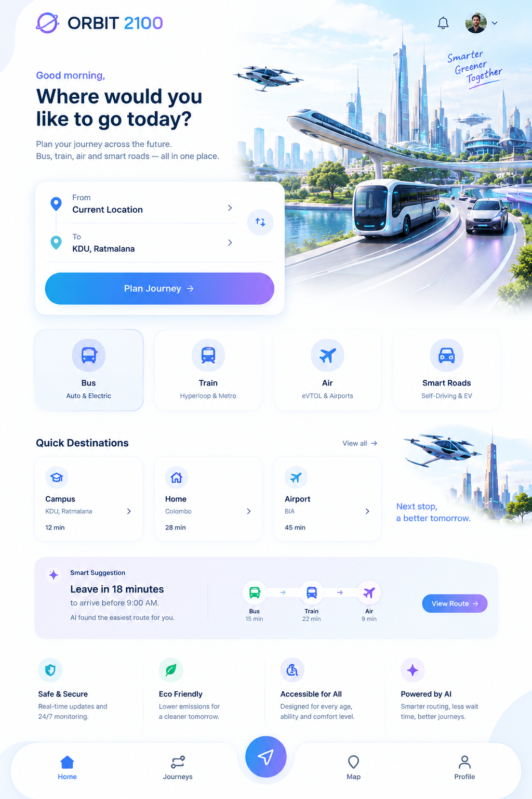

# UniBuddy Study Planner

Added a persistent Study Planner to the existing UniBuddy project.

## Features
- Dashboard with today's plan, completion progress and upcoming tasks
- Add tasks with title, subject, type, date, time, duration, priority and notes
- Academic subject picker using Year → Semester → Subject data
- Task types: Study, Revision, Assignment, Past Paper, Project, Reading
- Complete/uncomplete tasks with haptic feedback
- Delete tasks
- Persistent local save using SharedPreferences
- Home dashboard reminder card updates immediately after saving a task
- Upcoming tasks and today's tasks sections

## Run
```powershell
c
```
